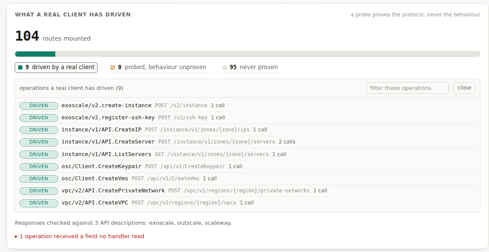
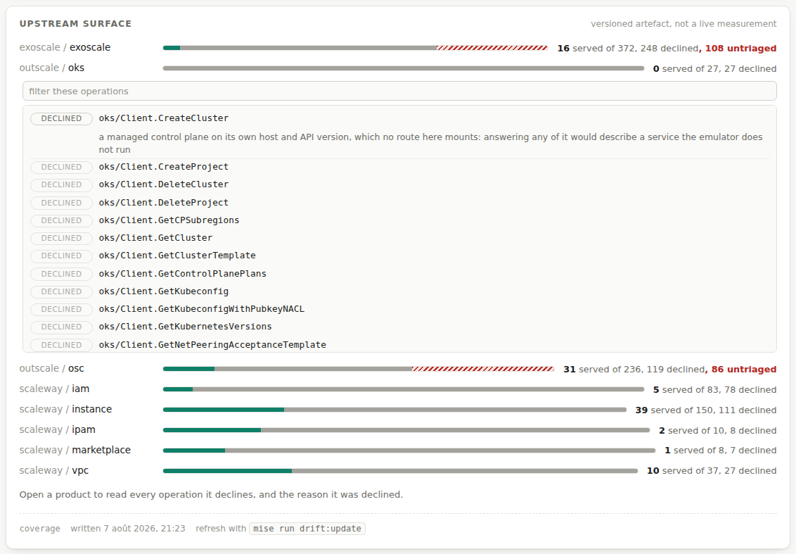
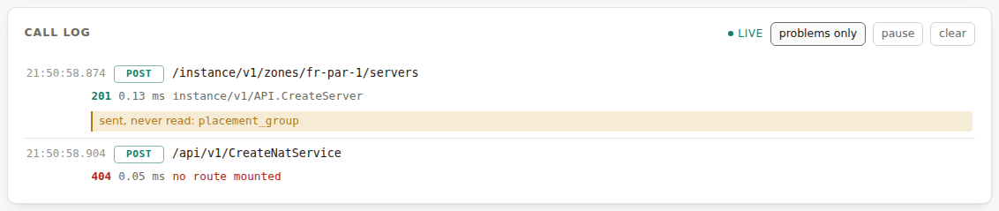

<picture>
  <source media="(prefers-color-scheme: dark)" srcset="docs/assets/brand/feint-lockup-dark.svg">
  
</picture>


# Feint

*A local emulator for the European clouds — Scaleway, Outscale, Exoscale.*

**One binary. One port. No account, no bill.**

[](https://github.com/stephrobert/feint/actions/workflows/conformance.yml)
[](https://github.com/stephrobert/feint/actions/workflows/drift.yml)
[](https://securityscorecards.dev/viewer/?uri=github.com/stephrobert/feint)
[](./go.mod)
[](./LICENSE)

**Read this in another language:** [Français](./README.fr.md)

[Install](#install) • [Use it](#use-it) • [What is proven](#status) •
[Commands](#commands) • [What it does not do](docs/limits.md) •
[Contributing](CONTRIBUTING.md)

> [!WARNING]
> **Under active development, version 0.x, and not free of bugs.** Two
> whole-pack adversarial audits, one per provider, found defects on every path
> the conformance suite does not walk — including in the fixes of the previous
> round. What a real client is proven to drive is counted in *What is proven*
> below and in `/_feint/conformance`; what is refused, and why, is in
> [docs/routes.md](docs/routes.md). Everything else is unproven until it is
> measured. Do not point anything you care about at it, and do not read a
> passing command as a guarantee: report what breaks, that is what moves the
> numbers.

## Quick start

<!-- banner:start -->
```bash
feint serve
#  feint dev listening on 127.0.0.1:4599
#    scaleway  57 routes
#    outscale  72 routes
#    exoscale  46 routes
#    machines  none
```
<!-- banner:end -->

That is one endpoint for three clouds. They do not collide in URL space —
Scaleway serves `/<product>/v<N>/…`, Outscale `POST /api/v1/<Action>`, Exoscale
`/v2/<resource>` — so one `http.ServeMux` hosts all three, and the server refuses
to start if two packs claim the same route.


Every command in that recording really ran: the emulator starts, the official
`scw` CLI creates a server, the official Terraform provider applies a
configuration through `api_url`, and the emulator stops. It is generated from
[`tools/demo/quickstart.tape`](tools/demo/quickstart.tape) with `mise run demo`,
so a command that breaks breaks the demo. A recording nobody can re-run is a
claim, and the whole argument here is that a claim is not a proof.

A second tape covers the part a mock cannot do:
[`tools/demo/network.tape`](tools/demo/network.tape) drives the official Outscale
CLI to create a Net, a Subnet and a Vm, then asks **the runtime rather than the
emulator** what exists — `incus list` shows a container holding the exact address
the API published, on that subnet, and holding nothing once the emulator stops.
It needs Incus with OVN; `mise run demo:network` records it.

---

## Contents

- [Quick start](#quick-start)
- [Install](#install)
- [Use it](#use-it)
- [The page](#the-page)
- [Real machines, on request](#real-machines-on-request)
- [Status](#status)
- [Commands](#commands)
- [Background](#background)
- [Contributing](#contributing)
- [License](#license)

---

## Install

### Prerequisites

**None, for what most people came for.** Feint is one static binary with no
external dependencies: it emulates the three control planes, holds its state in
memory, and needs no daemon, no container runtime and no account. If you are
pointing `scw`, `oapi-cli`, `exo` or Terraform at an emulator, stop reading here
and go to [Install](#install).

Two things are needed only for what they enable:

<!-- prereq:start -->
<!-- Generated by `mise run docs:coverage`. Do not edit by hand. -->

| What | Version | What it buys you |
|---|---|---|
| Go | 1.26 | Building from source. A released binary needs nothing. |
| [Incus](https://linuxcontainers.org/incus/) | 7.2 recommended, **6.0.4 minimum** | `--vm`: powered-on servers become real containers or KVM machines you can `ssh` into. |
| OVN (`ovn-central`, `ovn-host`, Open vSwitch) | optional | `--vm incus-ovn`: subnets that are actually separate, so two VPCs cannot reach each other. |

6.0.4 is a floor rather than a preference: below it the runtime refuses ACLs on a
NIC, and the failure reads like a Feint bug rather than a missing feature. Ubuntu
24.04 ships 6.0.0 and will not move past it, so the Zabbly stable channel is the
practical way to a supported version. `feint doctor` checks all of this against
the same 6.0.4, and says what to install, which is the point of having it.
<!-- prereq:end -->

---


### A released binary

<!-- install:start -->
<!-- Generated by `mise run docs:coverage`. Do not edit by hand. -->

Version **0.7.2**, named rather than fetched as `latest`: a mutable reference
downloads whatever is newest, which is a binary neither of us can name
afterwards and a release adopted the day it is published. This line moves when
the CHANGELOG does, and `feint docs --check` fails until it has.

Needs `cosign` (or `gh`, further down) and nothing else. Every file is fetched
to disk and verified before anything runs it.

```bash
base=https://github.com/stephrobert/feint/releases/download/v0.7.2

# The published binary for this machine, or a refusal: no default, because
# the wrong architecture fails at exec with a message naming neither.
case "$(uname -s)-$(uname -m)" in
  Darwin-x86_64) asset=feint-darwin-amd64 ;;
  Darwin-arm64)  asset=feint-darwin-arm64 ;;
  Linux-x86_64)  asset=feint-linux-amd64 ;;
  Linux-aarch64) asset=feint-linux-arm64 ;;
  *) echo "no published binary for $(uname -s)-$(uname -m)" >&2; exit 1 ;;
esac

curl -fsSLO "$base/$asset"
curl -fsSLO "$base/checksums.txt"
curl -fsSLO "$base/checksums.txt.cosign.bundle"

# Who produced the list, before trusting a single hash inside it. One
# signature covers every artefact, because every hash is in this file.
cosign verify-blob --bundle checksums.txt.cosign.bundle \
  --certificate-identity-regexp 'https://github.com/stephrobert/feint/.*' \
  --certificate-oidc-issuer https://token.actions.githubusercontent.com \
  checksums.txt

# Then the bytes against the list. Without --ignore-missing this fails on
# every platform you did not download, which reads like a bad binary.
sha256sum -c checksums.txt --ignore-missing

install -m 0755 "$asset" ~/.local/bin/feint
```

With `gh`, which checks the build provenance instead: it proves which
workflow and which commit produced the binary, where the signature above
proves who published the list.

```bash
gh release download v0.7.2 --repo stephrobert/feint --pattern 'feint-linux-amd64'
gh attestation verify feint-linux-amd64 --repo stephrobert/feint
```

| Binary | Control plane | `--vm`: real machines |
|---|---|---|
| `feint-darwin-amd64` | **exercised**: tests and race detector, skipped on private forks | **impossible**: Incus publishes no macOS server |
| `feint-darwin-arm64` | **exercised**: tests and race detector, skipped on private forks | **impossible**: Incus publishes no macOS server |
| `feint-linux-amd64` | **exercised**: tests, race detector, and it answers | possible; proven by the release table below, never in CI |
| `feint-linux-arm64` | **exercised**: tests and race detector, skipped on private forks | Incus is packaged for it; nothing here has proven it |

**`--vm` is off by default, and no workflow turns it on.** Starting machines is
a side effect on whoever's host runs it, so it is asked for rather than assumed,
and the conformance suite has to stay runnable where no runtime exists — which
is CI. The network suites skip themselves there and say so. What proves that
mode is `FEINT_VM=incus-ovn mise run conformance` on a host with Incus, and the
eight virtual machines in the table below.

The non-amd64 runners are free here and billed on a private repository, so the
job skips on a private fork rather than spending somebody's minutes without
asking. A fork that wants that coverage removes the condition, which is one
line.

Older versions stay downloadable at their own tag: nothing here rewrites what
a previous release published.
<!-- install:end -->

Releases also carry a CycloneDX SBOM and, on `dist/feint-*`, a SLSA build
provenance attestation. `docs/install.md` splices the same block from the same
source, so the two pages cannot drift apart.

Or from the module proxy, which needs a Go toolchain, builds rather than
downloads, and therefore verifies none of the above:

```bash
go install github.com/stephrobert/feint/cmd/feint@latest
```

### From source

The Go version in the [prerequisites](#prerequisites) table, and nothing else.
The module has **no external dependencies** — a pre-commit hook keeps it that
way, and `go.mod` is three lines.

```bash
git clone https://github.com/stephrobert/feint
cd feint
go build -o feint ./cmd/feint
./feint version
```

### With mise, for development

```bash
mise trust && mise install     # pinned Go, Python, uv and the linters
mise run serve                 # the emulator on 127.0.0.1:4599
mise tasks                     # everything else
```

---

## Use it

Start the emulator once. Everything below talks to the same process.

```bash
feint start          # detaches, waits until it answers, prints where the log is
feint status         # what it mounts, and how much of it a client has driven
curl -s localhost:4599/_feint/health | jq -c '{status, machines, capabilities}'
# {"status":"ok","machines":"none","capabilities":{"machines":false,"addresses":false,"firewall":false,"isolation":false,"own_kernel":false}}
```

`capabilities` is what the running mode can actually prove. With no machine
runtime everything is false and the emulator is a control plane; the
[runtime modes](#the-modes-are-not-equivalent-and-one-difference-matters)
section says what each one changes.

`start` backgrounds itself — no `&`, no Docker. None of the comparable emulators
can: a JVM and a CPython process cannot cleanly daemonise, so LocalStack, floci
and ministack all delegate detaching to `docker run -d`. A static Go binary does
not need to.

Then point a client at it, without copying anything by hand:

```bash
eval "$(feint env scaleway)"
scw instance server list zone=fr-par-1
```

`env` prints only export lines on stdout, so `eval` is safe; every hint and
caveat goes to stderr. `feint env scaleway --unset` is the way back to the real
cloud in the same shell.

The credentials it prints are deliberately fake and deliberately public. The
emulator never checks them; the official clients refuse to sign a request whose
credentials are not *well-formed*, which is the only reason they exist. They live
in `tools/conformance/<provider>/fake-credentials.env`, and `env` reads the same
values, so the CLI and the conformance suites cannot drift apart.

The sections below spell the variables out per provider, for anyone who would
rather see them than eval them.

### Scaleway — the `scw` CLI

`scw` reads its endpoint from `SCW_API_URL`, so nothing else is needed.

```bash
export SCW_API_URL=http://127.0.0.1:4599
export SCW_ACCESS_KEY=SCWXXXXXXXXXXXXXXXXX
export SCW_SECRET_KEY=11111111-1111-1111-1111-111111111111
export SCW_DEFAULT_PROJECT_ID=11111111-1111-1111-1111-111111111111
export SCW_DEFAULT_ORGANIZATION_ID=99999999-9999-4999-8999-999999999999
export SCW_DEFAULT_ZONE=fr-par-1
export SCW_DEFAULT_REGION=fr-par
export SCW_INSECURE=true          # the emulator answers plain HTTP

scw instance server create name=demo type=DEV1-S image=ubuntu_jammy zone=fr-par-1
scw instance server list zone=fr-par-1
```

Terraform reaches it through the provider's `api_url`. A working configuration is
in [`tools/conformance/scaleway/terraform/`](tools/conformance/scaleway/terraform/),
and both `terraform` and `tofu` are run against it in CI.

### Outscale — `oapi-cli`

`oapi-cli` has no `--endpoint` flag: it is configured through a JSON profile. The
endpoint is the **bare host** — the CLI appends `/api/v1/<Call>` itself, so
passing `http://host/api/v1` produces a request for `/api/v1/api/v1/<Call>`, a
404 that looks exactly like a missing route.

```bash
cat > /tmp/osc.json <<'EOF'
{
  "default": {
    "access_key": "AAAAAAAAAAAAAAAAAAAA",
    "secret_key": "BBBBBBBBBBBBBBBBBBBBBBBBBBBBBBBBBBBBBBBB",
    "region": "eu-west-2",
    "protocol": "http",
    "endpoints": { "api": "http://127.0.0.1:4599" }
  }
}
EOF

oapi-cli --config /tmp/osc.json CreateVms --ImageId ami-00000001 --VmType tinav6.c1r1p2
oapi-cli --config /tmp/osc.json ReadVms
```

`osc-cli` is deprecated and addresses `/api/latest/<Call>` where the current API
is `/api/v1/<Call>`; pointing it here fails for a reason that says nothing about
the emulator.

### Exoscale — the `exo` CLI

`exo` is redirected through the `EXOSCALE_API_ENDPOINT` environment variable, or
the `endpoint` key of its own configuration file, and that value **must carry the
`/v2` suffix**: the CLI concatenates it with the route it wants rather than
adding a version segment. Measured on `exo` 1.95.1, in both directions: pointed
at the emulator it drives it, pointed at a dead port it fails naming that port.

```bash
export EXOSCALE_API_ENDPOINT=http://127.0.0.1:4599/v2
export EXOSCALE_API_KEY=EXOxxxxxxxxxxxxxxxxxxxx
export EXOSCALE_API_SECRET=aaaaaaaaaaaaaaaaaaaaaaaaaaaaaaaaaaaaaaaa

exo compute instance-template list
exo compute instance create demo \
  --zone ch-dk-2 --template "Linux Ubuntu 24.04 LTS 64-bit" --instance-type standard.tiny
exo compute instance list
```

### Ask the emulator what it is doing

```bash
curl -s localhost:4599/_feint/routes | jq -r '.[].operation' | sort
curl -s localhost:4599/_feint/conformance | jq .
```

The second one is worth knowing about when something misbehaves: it reports the
**fields your client sent that no handler read**. That is the cause more often
than not, and it is how a Vm that reported success while going nowhere was found.

---

## The page

```bash
feint ui             # opens a browser at http://127.0.0.1:4599/_feint/ui
```

One page, served by the binary itself. No second port, no second process, no
build step, no dependency: three files embedded in the binary, and every value
arrives by `fetch` and reaches the document through `textContent`.



It shows the four things nothing else here shows together:

- **served against driven against probed**, side by side and never added up. The
  bar is one bar and the probed part is hatched rather than filled, because a
  probe proves the protocol and nothing else — an emulator answering a
  well-formed empty object would pass every one of them. Each of the three
  numbers opens onto the operations behind it.
- **the upstream gap**, per product, with the date of the artefact it was read
  from and the command that refreshes it. Open a product and you get every
  operation it declines *and the reason it was declined* — 625 of them across the
  three packs, each an argument written in the pack rather than a number.
- **everything the session created**, read from the store rather than from a
  provider API, so a pack nobody has written yet appears with its own vocabulary.
  Whole attributes, folded, with one search box over ids, types, states and the
  attributes themselves.
- **a live call log**: what went through, in order, with the time, the status,
  the duration, the operation — plus the two lines that are the point, the fields
  a client sent that no handler read and the fields an answer carried that the
  provider's own API description does not define.





Those images are regenerated by `mise run docs:ui`, which drives the page in a
headless browser, **asserts that its nodes carry the values the endpoints
answered**, and only then photographs it. `feint docs --check` fails when the page
has changed since they were taken, so they cannot quietly become pictures of a
screen that no longer exists — the same gate the generated tables have used since
the README claimed 12 routes where 55 were served.

It is read-only, and mechanically so: every route it adds is a `GET`, asserted by
enumerating the mux, and the log arrives on a one-way event stream. There is no
delete button, no create form, and no path from the page to a command.

**It is served on loopback only, and there is no authentication, ever.** Off
loopback the page is not hidden — it does not exist, and the one endpoint left
answers 404 saying why. A login screen would protect the wrong boundary: the
threat is a page in the operator's browser driving the emulator, and a secret
held by that same browser is inherited by the hostile page, which is the
definition of CSRF. What works is the `Origin` refusal, and it is measured. This
service also accepts every credential by design, so a login on it would be a
fourth fake credential — the only one not documented as fake.

The same ring the page reads is available to a script:

```bash
curl -s localhost:4599/_feint/trace | jq -r '.exchanges[] | "\(.method) \(.path) \(.status) \(.operation // "no route mounted")"'
```

That is what makes it a mechanism rather than an interface feature: an event
stream needs a listener before the interesting thing happens, and a conformance
assertion runs after.

---

## Real machines, on request

By default the emulator is a control plane: it answers, and nothing runs. Give it
a runtime and a created server becomes a real container or virtual machine, on a
real bridge, with the address the API published.

```bash
FEINT_VM=auto      mise run serve   # the most capable runtime that answers
mise run conformance:ssh            # register a key, boot a server, log in over ssh
```

That mode needs Incus and OVN, and how to install them differs enough per
distribution to be worth measuring: **[docs/install.md](docs/install.md)** carries
the commands, measured on a fresh virtual machine of Debian 12 and 13, Ubuntu 24.04
and 26.04, Fedora 43 and 44, and Rocky 9. Rocky 10 is listed too, as *not
measured*: EPEL and Zabbly still package no Incus for Enterprise Linux 10, and
the COPR chroot that appeared for it (checked 2026-07-30) has not been driven
by the install play yet.

This is what separates Feint from a mock server, and it is measured rather than
claimed: the block a client asks for is the block it gets, the address the API
publishes is the address the machine carries, a security group's default policy
closes a port for real, and authorising it afterwards opens it without restarting
anything.

### The modes are not equivalent, and one difference matters

There are three runtimes and they do not deliver the same thing. The table is
what `tools/conformance/scaleway/network.sh` actually returns, run in each mode
on 2026-07-29:

| `--vm` | Machines | Addresses | Firewall | **Isolation** | Own kernel | Needs |
|---|:--:|:--:|:--:|:--:|:--:|---|
| `off` *(default)* | — | — | — | — | — | nothing |
| `incus` | yes | yes | yes | **no** | no | Incus 6.0.4+ |
| `incus-vm` | yes | yes | yes | **no** | yes | Incus + KVM |
| `incus-ovn` | yes | yes | yes | **yes** | no | Incus + `ovn-central`, `ovn-host`, Open vSwitch |

**Exactly one assertion in the whole network suite changes verdict with the
mode**, and it is the one carrying the project's strongest claim: two private
networks of two *different* VPCs must not reach each other. Measured: 16 checks
green on `incus` with that one skipped, 17 green on `incus-ovn` with nothing
skipped for want of a capability.

Why the bridge mode cannot do it is not a gap to be filled later. The runtime
documents it — *"traffic between managed bridge networks on the same server isn't
NATed as it's routed directly between the bridges"* — and two workarounds were
measured here and abandoned: both stop holding once the interfaces carry a
security group of their own. An OVN network is a logical network with its own
router, so the separation is the topology's rather than a rule's.

Everything else — the block, the address on the interface, the firewall applying
without a restart, a flexible IP routed and revoked — holds identically in both.
So the bridge mode is not a lesser emulator; it is the same emulator without
subnet isolation, at a much lower installation cost.

**Ask the emulator rather than guessing.** It declares what the running mode can
prove:

```bash
curl -s localhost:4599/_feint/health | jq .capabilities
# {"machines":true,"addresses":true,"firewall":true,"isolation":false,"own_kernel":false}
```

`--vm auto` picks the most capable runtime that answers — OVN first, then the
bridge — and prints what it chose along with whether isolation is on. It never
picks `incus-vm`: a virtual machine costs tens of seconds to boot where a
container costs seconds, and that is a trade you make on purpose.

**Incus is the only runtime, and that is a decision.** Emulating a cloud means
emulating its network: a bridge on a chosen block, a fixed address per interface
from boot, and rules actually enforced. Incus provides all three natively; the
Docker driver provided one and a half and was removed. Every measurement behind
this section, including the ones that went the wrong way, is in
[docs/limits.md](docs/limits.md).

Everything the emulator creates is labelled, and `feint clean` removes exactly
those. Nothing else on your host is touched.

---

## Status

| Provider | Protocol | Proven by | Maturity |
|---|---|---|---|
| Scaleway | REST JSON, `X-Auth-Token` | `scw`, Terraform, OpenTofu | usable |
| Outscale | `POST /api/v1/<Action>`, AWS Signature v4 | `oapi-cli`, Terraform | starter |
| Exoscale | REST `/v2/<resource>`, asynchronous operations | `exo` | starter |

*Usable* means a realistic configuration applies and destroys. *Starter* means
the protocol is right and a real client drives a real workload, but the surface
is still thin: see the coverage tables below, and
[docs/limits.md](docs/limits.md) for what that costs you.

Exoscale has no Terraform column, and that is not a gap in this emulator. The
provider honours `EXOSCALE_API_ENDPOINT` for one of the two clients it builds
and reaches the real cloud with the other, so an apply splits between here and a
paying account — which is why the emulator refuses that client outright rather
than serve half of it. Filed upstream as
[#573](https://github.com/exoscale/terraform-provider-exoscale/issues/573). A
patched build that closes the split is documented in
[docs/limits.md](docs/limits.md#the-patched-provider-while-upstream-decides),
and it deliberately counts for nothing here: a client this project patched is no
longer the official client.

Every command in the [Use it](#use-it) section above is executed against the
emulator before it is written here.

Which client, in which version, and it is not decoration for a project whose
argument is that the upstream moves:

<!-- clients:start -->
<!-- Generated by `mise run docs:coverage`. Do not edit by hand. -->

| Client | Version proven in CI | Emulated provider |
|---|---|---|
| `scw` | 2.56.3 | Scaleway |
| Terraform | 1.13.3 with provider `scaleway/scaleway ~> 2.79` | Scaleway |
| OpenTofu | 1.12.5 | Scaleway |
| `oapi-cli` | 0.15.0 | Outscale |
| `exo` | 1.95.6 | Exoscale |

These are the versions the conformance workflow installs and runs on every
pull request and nightly. A newer client is not known to work until the pin
moves and the suite passes on it, which is the whole point of pinning it.
<!-- clients:end -->

The full list of served routes, and of the operations each pack declines on
purpose, is in [docs/routes.md](docs/routes.md). It is generated by the binary
that serves them.

### Coverage

<!-- coverage:start -->
<!-- Generated by `mise run docs:coverage`. Do not edit by hand. -->

175 routes are mounted across the three packs. The tables count *upstream operations*
rather than routes: what the provider's own SDK or API description declares, against
what this emulator serves, declines on purpose, or has not triaged yet.

#### Outscale

72 routes mounted, 27% of the measured upstream surface served.

| Product | Served | Declined | Untriaged | Upstream |
|---|--:|--:|--:|--:|
| `oks` | 0 | 27 | 0 | 27 |
| `osc` | 72 | 146 | 18 | 236 |
| **Total** | **72** | **173** | **18** | **263** |

#### Scaleway

57 routes mounted, 19% of the measured upstream surface served.

| Product | Served | Declined | Untriaged | Upstream |
|---|--:|--:|--:|--:|
| `iam` | 5 | 78 | 0 | 83 |
| `instance` | 39 | 111 | 0 | 150 |
| `ipam` | 2 | 8 | 0 | 10 |
| `marketplace` | 1 | 7 | 0 | 8 |
| `vpc` | 10 | 27 | 0 | 37 |
| **Total** | **57** | **231** | **0** | **288** |

#### Exoscale

46 routes mounted, 12% of the measured upstream surface served.

| Product | Served | Declined | Untriaged | Upstream |
|---|--:|--:|--:|--:|
| `exoscale` | 46 | 253 | 75 | 374 |
| **Total** | **46** | **253** | **75** | **374** |

**Declined** is a decision, not a gap: an operation nobody intends to emulate,
with the reason in the pack's `Declined()`. **Untriaged** is the honest column —
upstream operations nobody has ruled on yet. A new one appearing there fails CI
until somebody decides, which is the whole point of measuring the surface
instead of following it by hand.
<!-- coverage:end -->

**Emptying the untriaged column is planned, not hoped for.** One roadmap per
provider states what its IaaS layer means here, which official-client command
breaks on each missing product today, and the batches that close it — each with
the real conformance run that ends it:

- [docs/roadmap-scaleway-iaas.md](docs/roadmap-scaleway-iaas.md) — six batches,
  and the three architecture decisions the other two inherit
- [docs/roadmap-outscale-iaas.md](docs/roadmap-outscale-iaas.md) — five batches;
  half the untriaged column is refusals to write, not code
- [docs/roadmap-exoscale-iaas.md](docs/roadmap-exoscale-iaas.md) — six batches,
  starting with the 250 operations this pack declines nothing about yet

**Object storage is out of scope for now.** The Scaleway Terraform provider
hardcodes `https://s3.<region>.scw.cloud`, so it needs DNS interception and TLS
rather than an endpoint setting. Exoscale's `sos-endpoint` is served empty for the
same reason: an invented address is a promise the emulator cannot keep. See
[docs/limits.md](docs/limits.md), which states every limit that was measured
rather than assumed.

---

## Commands

| Command | What it does |
|---|---|
| `feint start` / `stop` / `restart` | run it in the background, and stop it |
| `feint wait` | poll until it answers — the CI verb |
| `feint status` | what is running, what it mounts, what a client has driven |
| `feint logs` | the detached run's log |
| `feint ui` | open the emulator's own page — read-only, loopback only |
| `feint env <provider>` | the environment a real client needs, for `eval` |
| `feint doctor` | diagnose the host: the port, the machine runtime, the clients, the ssh trap |
| `feint snapshot` | `save`, `load`, `list`, `rm` — name a running emulator's state and come back to it |
| `feint serve` | serve the three emulated clouds on one port, in the foreground |
| `feint coverage` | compare the upstream API surface with what the packs serve |
| `feint proxy` | sit between a real client and a real cloud and record every exchange, credentials redacted |
| `feint transcript` | read a recording: what to serve next, what a response must look like, what the emulator omits |
| `feint probe` | drive every mounted route from its API description and check the answers |
| `feint docs` | regenerate the coverage tables in this README |
| `feint catalog` | print the emulated inventory a client reads before creating |
| `feint clean` | remove every machine, network and rule set the emulator created |
| `feint version` | print the version |

`feint --help` gives the flags. Exit codes are stable because CI depends on
them: **0** ok, **1** error, **2** drift detected. `status` is the one verb that
always exits 0, because a stopped emulator is a fact rather than a failure — the
verb that gates is `wait`.

`feint proxy` and `feint transcript` are the record-then-read pair that turns a
real client against a real cloud into the next operation to serve, the shape its
response must have, and the fields the emulator omits today.
**[docs/proxy.md](docs/proxy.md)** is the workflow, including the read-only
discipline a billed account demands.

---

## Background

AWS has LocalStack. Azure has Azurite. European clouds have had nothing, and
their users test against a paying account or not at all.

Feint emulates their APIs so that SDKs, CLIs and Terraform run against your
laptop. **Scaleway, Outscale and Exoscale are the first three** — the
architecture exists so a fourth changes nothing outside its own pack, and the
scan that keeps them honest reads whatever SDK or API description that provider
publishes.

The name is the fencing move: *feinte*, from Old French *feindre* — a movement
made to look like the real one, so the opponent commits. That is the whole test
here. The official client commits, and cannot tell.

The mark draws the same argument: a solid line for the surface actually served, a
dashed one leaving the same corner at the same angle for what the provider
announced and nobody has driven yet. [docs/brand.md](docs/brand.md) has the files
and what may be done with them.

### Why not a mock server

A mock returns what you told it to return. It cannot tell you that the field you
invented does not exist, that the CLI reads three other endpoints before it
creates anything, or that the API renamed an operation last month.

Two failures make the difference concrete, both found here:

- `CreateVms` read a `VmCount` the Outscale API does not have — it says
  `MinVmsCount` and `MaxVmsCount` — so every request created one machine whatever
  it asked for. A mock configured with the same wrong field would have agreed.
- The Scaleway pack once served an invented `private_ip` that its own test suite
  read back, proving the emulator against itself.


### Why not hand-written emulation

Because the surface moves faster than anybody can follow by hand. Scaleway added
363 operations and removed 25 in the twelve months to 2026-07-28 — measured by
running this repository's own surface scan on two dated checkouts of their SDK
(`de749e3`, 2025-07-25, and `06ce682`, 2026-07-28) and diffing the operation
lists. Writing 200 000 lines by hand,
as the alternative approach does for AWS, means being wrong within a quarter and
not knowing which quarter.

**So the surface is measured, not followed.** Three mechanisms, and they take
precedence over any other design consideration:

1. **The surface scan** (`internal/drift`) parses the provider's official Go SDK,
   which is generated from their own IDL and therefore exact. No network call, no
   assumption.
2. **The baseline** is committed. An operation that appears upstream and that
   nobody has triaged fails CI. Not "not yet supported" — *undecided*, which is a
   different and more useful thing to know.
3. **The conformance suites** replay the real clients: `scw`, `oapi-cli`, `exo`,
   Terraform and OpenTofu, in CI, on every pull request.

On top of that, every response is validated against the provider's own OpenAPI
document when the emulator runs with `--contracts`. That is not tidiness: 643 of
Outscale's 650 schemas declare `additionalProperties: false`, so a field they do
not define is a violation *they* wrote down.

```bash
mise run drift:check     # exit 2 if the upstream surface moved
mise run drift:update    # after triaging: implement, or decline with a reason
```

A weekly job runs the scan and **opens a pull request** the moment upstream moves.
The human work is triage.

---

## Contributing

Read [CONTRIBUTING.md](CONTRIBUTING.md) first. It carries the one rule of this
repository — **a change to emulated surface is not done until a real client
exercised it**, because a unit test asserts what we believe an API does and only
the official client asserts what it is — plus the commit format the version is
derived from, and how an issue title is written.

Then [docs/architecture.md](docs/architecture.md): what the neutral core is,
where a provider's knowledge is allowed to live, and what a request does from the
mux to the response shape.

```bash
mise install           # pinned Go, Python, uv and the linters
pre-commit install     # the local gates; not optional, see CONTRIBUTING.md
mise run check         # gofmt, vet, golangci-lint, go test -race
mise run conformance   # every real client against it
mise run drift:check   # did the upstream API move?
mise run fuzz          # fuzz the request decoders
```

- **AI-assisted contributions** are welcome, disclosed with `Assisted-by:`, and
  judged by whether the real client drives the change rather than by what wrote
  it: [the policy](CONTRIBUTING.md#ai-assisted-contributions)
- What each conformance suite proves: [tools/conformance/](tools/conformance/)
- Installing the machine runtime: [docs/install.md](docs/install.md)
- What is intentionally not emulated, and why: [docs/limits.md](docs/limits.md)
- Where this is going: [docs/roadmap.md](docs/roadmap.md), and per provider —
  [Scaleway](docs/roadmap-scaleway-iaas.md),
  [Outscale](docs/roadmap-outscale-iaas.md),
  [Exoscale](docs/roadmap-exoscale-iaas.md)
- What a fourth provider pack would cost: [docs/fourth-pack.md](docs/fourth-pack.md)
- Reporting a vulnerability: [SECURITY.md](SECURITY.md)

---

## License

Apache 2.0 for the code. **The name and the logo are not covered by it** —
[docs/brand.md](docs/brand.md) says what may be done with them, which is most
things.

Apache 2.0. See [LICENSE](LICENSE).

Feint emulates APIs compatible with the SDKs, CLIs and Terraform providers of
Scaleway, 3DS Outscale and Exoscale. It is an **independent project, not
affiliated with, endorsed by, sponsored by or certified by** any of them. Those
names appear here only to identify which APIs are emulated, which is what
referential use permits; no logo, colour or typeface of theirs is used anywhere
in this repository, and none of it may be added.
